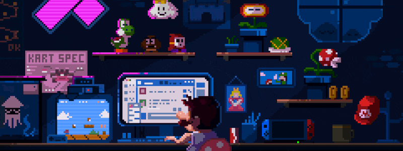

  

 

  

 

  <h1>🎓 About Me 🎓</h1>
  <h3 align="center">
   Computer Science student passionate about harnessing the potential of technology to drive innovation. My academic and professional pursuits are centered on mastering back-end development, with a focus on creating efficient and scalable solutions.
  </h3>

<h1 align="center">⚒️ Languages-Frameworks-Tools ⚒️</h1>

 

     
     

  

<h1 align="center">📈 Stats 📈</h1>

  

